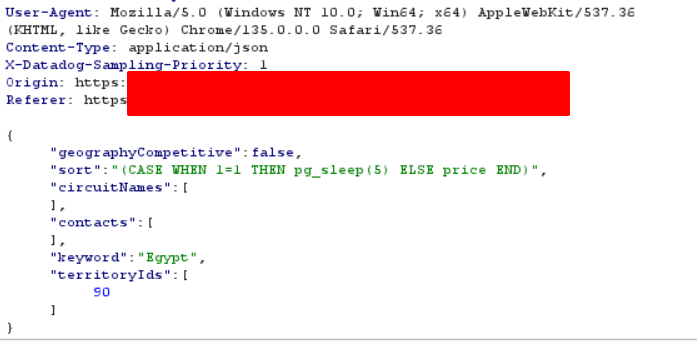

# SQLi

<mark style="color:yellow;">The theory of SQLi: What really is injection?</mark>&#x20;

There are two types of languages that can be used to create programs to interact with computers. There are interpreted languages, and then comes compiled languages. Interpreted languages use a run-time component that takes the code of the language, along with any input if provided by the user, interprets this code into machine-readable language and then executes it at runtime. All of the above happens at run-time, not before the run-time. On the other hand, for compiled languages, all the code that is written gets generated into machine-readable code at the time of writing, and then is directly processed by processor at run-time.&#x20;

<figure><figcaption></figcaption></figure>

Now, most of the web-app technologies such as SQL, PHP, Perl, LDAP etc are written using interpreted languages. As such, for any useful application that expects a user to interact with it, it will wait for the user-input, combine that with the already-existing code of the application, then interpret it into machine-readable code (all of this happening at run-time, when the user supplies an input and expects to receive an output from the application). Now, if the user supplies an input that deliberately breaks the context of the application code (since most codes have grammar syntaxes, and these syntaxes can be broken out of through custom payload), this user-input will get combined with the already existing code of the application, and the interpreter may confuse part of the user-supplied input as program instructions, and execute those instructions, thereby providing us with an injection vulnerability :)

If this specific injection attack is targeted against datastores such as SQL, and is used to extract data that a user may not initially have access to, then this attack is known as a SQL Injection attack. One of the main reasons why it is possible is because generally speaking, applications use the same privilege level roles for all types of access to the data store and when they process the data that belongs to different application users. &#x20;

### <mark style="color:yellow;">How to detect SQL injection vulnerabilities:</mark>

You can detect SQL injection manually using a systematic set of tests against every entry point in the application. To do this, you would typically submit:

* The single quote character `'` and look for errors or other anomalies.
* Some SQL-specific syntax that evaluates to the base (original) value of the entry point, and to a different value, and look for systematic differences in the application responses.
* Boolean conditions such as `AND 1=1` and `AND 1=2`, and look for differences in the application's responses.
* Payloads designed to trigger time delays when executed within a SQL query, and look for differences in the time taken to respond.
* OAST payloads designed to trigger an out-of-band network interaction when executed within a SQL query, and monitor any resulting interactions.

Alternatively, you can find the majority of SQL injection vulnerabilities quickly and reliably using Burp Scanner.

### The WHERE clause:

<figure><figcaption></figcaption></figure>

The WHERE clause is used to extract data for specific conditions. A combination of SELECT and WHERE clauses is used to extract data from a large database, as shown in the image above.&#x20;

<mark style="color:yellow;">Most SQL injection vulnerabilities occur within the</mark> <mark style="color:yellow;"></mark><mark style="color:yellow;">`WHERE`</mark> <mark style="color:yellow;"></mark><mark style="color:yellow;">clause of a</mark> <mark style="color:yellow;"></mark><mark style="color:yellow;">`SELECT`</mark> <mark style="color:yellow;"></mark><mark style="color:yellow;">query</mark>.&#x20;

Some other common locations where SQL injection arises are:

* In `UPDATE` statements, within the updated values or the `WHERE` clause.
* In `INSERT` statements, within the inserted values.
* In `SELECT` statements, within the table or column name.
* In `SELECT` statements, within the `ORDER BY` clause.

***

### <mark style="color:yellow;">Difference between AND and OR operator when fetching data back (important to understand why to use AND v/s OR)</mark>

Let's take the following database as an example:

<figure><figcaption>
An unordered database, but ordering does not matter for now
</figcaption></figure>

Now, if we use the WHERE clause to specifically ask for a movie with Id=1, we get the following response:

<figure><figcaption>
The specific movie title is returned
</figcaption></figure>

Now, if we use the AND operator to specify a true and false case, responses are different in both scenarios:

<figure><figcaption>
With AND 1=1, both conditions (Id=1 and 1=1) are true, hence only the Id=1 movie is returned (expected response)
</figcaption></figure>

<figure><figcaption>
With AND 1=2, one condition (1=2) is not true, so even though Id=1 exists, we do not get the expected response
</figcaption></figure>

Now, what happens if we replace the following with OR clause?

<figure><figcaption>
OR 1=1 returns to true, so ALL THE DATA is returned back, whether requested or not
</figcaption></figure>

<figure><figcaption>
OR 1=2 returns false, but since Id=1 is true, at least the originally requested data is returned
</figcaption></figure>

<mark style="color:yellow;">**Amazing resource on why OR 1=1 is a bad payload explained by Tib3rius**</mark> (A must for interview preps): [https://www.youtube.com/watch?v=8iSGWP7lk-M](https://www.youtube.com/watch?v=8iSGWP7lk-M)

TLDR: Higher chances of false positives being detected due to usage of OR 1=1, along with the fact that if SQLi payload is instead used in an UPDATE or DELETE statement, then it can affect all entries, thereby messing up the whole database. Hence, AND 1=1 is a much better alternative.&#x20;

***

### <mark style="color:yellow;">ORDER BY and UNION Operators</mark>

#### ORDER BY

A lot of times, databases are not ordered at all. As a result, we can use the ORDER BY clause to arrange the databases based on values in the column. For example, look at the following image, and observe how the database is not ordered at all:

<figure><figcaption>
Apart from Id, everything else is scrambled and not in a order. Title's don't have an order, neither do Director, Year or Length_Minutes
</figcaption></figure>

Now, what if we use the ORDER BY clause to order the database according to a specific column?&#x20;

<mark style="color:yellow;">`SELECT * FROM Movies ORDER BY 2`</mark>

<mark style="color:yellow;">`SELECT * FROM Movies ORDER BY Title`</mark>

<figure><figcaption>
The Titles are arranged in an ascending order now, thanks to the ORDER BY clause
</figcaption></figure>

This ORDER BY will be used as a part of SQLi attacks as well (UNION attacks), but ORDER BY can be used to detect how many columns are there in the database. The above table has 5 columns, so the max  value we can use with ORDER BY is 5. If we use ORDER BY 6, we will get an error, indicating that the amount of columns in the database is 5.&#x20;

<figure><figcaption>
ORDER BY 5 is allowed, and the database is sorted using the Length_minutes column
</figcaption></figure>

<figure><figcaption>
ORDER BY 6 returns an error, indicating that the number of columns is 5
</figcaption></figure>

#### UNION

UNION operator can be used to append the output of one SQL query to another SQL query, depending on the conditions that the amount of columns that are returned as a result of the queries are the same, and the data type returned from each column is also the same. For example, you cannot append a column containing integer to a column containing string data. Both of these points are explained with the following example:

Assume we have 2 databases named EMPLOYEE and CREDS being used by the application. EMPLOYEE contains employee name, employee ID and the department they work in. CREDS contains employee ID, employee name, and their password.&#x20;

<figure><figcaption></figcaption></figure>

<figure><figcaption></figcaption></figure>

Now, let's use the UNION keyword to return information from both tables:

<mark style="color:yellow;">`SELECT empId,name,dept FROM EMPLOYEE UNION SELECT empId,username,password FROM CREDS;`</mark>

Of course, the above query is generated because we know what columns and tables exist. The output is as follows:

<figure><figcaption></figcaption></figure>

Now, here's the reason why we have a few conditions that are required to be able to perform a UNION based SQLi attack:

1. Condition 1 states that both SQL queries should return the same amount of columns. The reason behind this is that when we use the UNION operator, the SQL database concatenates the data returned from the individual SQL queries one after the another. If the first query is requesting information for 3 columns, while the second (injected) query returns information for 2 columns, then this data cannot be concatenated/appended to the data returned from the first query, and as a result we will get an error.&#x20;

<figure><figcaption></figcaption></figure>

<figure><figcaption></figcaption></figure>

As we can see, we get an error stating that the SELECT statements have different number of columns. Hence, for the UNION based SQL injection attack to work, we will need equal number of columns to be returned by both queries.&#x20;

Thus, the UNION operator can be used in a broader SQLi attack known as <mark style="color:yellow;">SQLi UNION</mark> attacks.  However, things to keep in mind is that _<mark style="color:yellow;">**UNION Injection attacks are only possible in the case of a SELECT statement**</mark>_ (such as a request to retrieve some data). It is not possible to use UNION payloads for INSERT/UPDATE/DELETE statements, since UNION is defined in SQL as the means to combine result sets from SELECT queries.&#x20;

***

### <mark style="color:yellow;">UNION SQLi attacks</mark>

Conditions for SQLi UNION attacks:

1. The application is vulnerable to SQL Injection attacks (observed using ' or the AND operator), and the results of the queries is visible on the front-end.&#x20;
2. The individual queries return the same number of columns
3. The data type in each columns must be compatible between the individual queries

***

### <mark style="color:yellow;">Determining Number of Columns</mark>

Two ways:&#x20;

1. <mark style="color:yellow;">**Use the ORDER BY clause to understand how many columns exist in the database**</mark>. To do so, the payload can be something like <mark style="color:yellow;">`' ORDER BY 1 --`</mark>, <mark style="color:yellow;">`' ORDER BY 2 --`</mark>, etc. If the number of columns exists, the error will be the same, until <mark style="color:yellow;">`' ORDER BY n --`</mark> is written down, where n can be a numerical value, and it returns a different error message, indicating that n-1 is the right amount of columns in the database. The visual representation of this explanation is here: [https://app.gitbook.com/o/65aadIqgwZV5I8Tg5iJt/s/siyUAFJuZ9x3a3FZdkHB/oswe-and-bscp/closed-box-methodologies/sqli#order-by-and-union-operators](./#order-by-and-union-operators)
2. Use UNION SELECT payload, submitting different amounts of NULL values to understand what amount of NULL values returns a different response. The idea behind this is that NULL is convertible to any and all data types, hence it is compatible to any data that may be returned by the columns in the second database. For example, we start with <mark style="color:yellow;">`' UNION SELECT NULL --`</mark> , followed by <mark style="color:yellow;">`' UNION SELECT NULL, NULL --`</mark> , followed by <mark style="color:yellow;">`' UNION SELECT NULL, NULL, NULL --`</mark> etc, until there are a number of NULLs which are greater than the amount of columns in the secondary database, hence confirming the number of columns. _<mark style="color:yellow;">When the number of nulls matches the number of columns, the database returns an additional row in the result set, containing null values in each column. However, how this is rendered on the front-end side of the application may differ</mark>_. Sometimes, it may be an error indicating NullPointerException, sometimes there may be an extra row in a table representation, or <mark style="color:red;">sometimes there may be no error at all, which may make this attack ineffective</mark>.&#x20;

***

### <mark style="color:yellow;">Determining the columns with useful data</mark>

In 99% of the cases, the useful data we want will be string type data. As such, once we have figured out the number of columns, we need to understand which columns have string data in them, or string type compatible data in them. To do so, we can use the UNION SELECT payloads, but systematically inserting strings in them, one by one to see which payloads are successful.&#x20;

For example, if we have 4 columsn, our payloads could look like the following:

`' UNION SELECT 'a',NULL,NULL,NULL--`&#x20;

`' UNION SELECT NULL,'a',NULL,NULL--`&#x20;

`' UNION SELECT NULL,NULL,'a',NULL--`&#x20;

`' UNION SELECT NULL,NULL,NULL,'a'--`&#x20;

***

### <mark style="color:yellow;">INFORMATION SCHEMA</mark>

Now, if we need to extact information from other tables present in the database, we need to understand what the structure of the Database looks like. How many tables in the database, how many rows and columns in the table. All of this is vital information, and is stored in a read-only meta-database called Information Schema!

<figure><figcaption>
The InfomationSchema can be used to inquire about the list of tables, rows and columns
</figcaption></figure>

***

### <mark style="color:yellow;">SUBSTRING function</mark>

The SUBSTRING function in SQL server (SUBSTR in MySQL) allows users to perform string manipulation, including extracting a specific pattern of string. The format is as follows:

<mark style="color:yellow;">`SUBSTRING (string_expression, first_position, length_of_string)`</mark>

For example, we can use something like this:&#x20;

<mark style="color:yellow;">`SUBSTRING ((SELECT password FROM users WHERE username="administrator"),1,1)`</mark>

Now, this is how the above function will work:

<mark style="color:yellow;">`SELECT password FROM users WHERE username="administrator"`</mark> -> Obtain the password of the administrator user

<mark style="color:yellow;">`1,1`</mark> -> Grab the "first" character of the password string, and grab only the first character. If it was 1,2, we will grab the first two characters of the password string.&#x20;

So, a SQLi payload can be something like this:

<mark style="color:yellow;">`' AND SUBSTRING((SELECT password FROM users WHERE username='administrator'),1,1 = 'y`</mark>

The way this payload will work is as follows:

<mark style="color:yellow;">`SUBSTRING((SELECT password FROM users WHERE username='administrator'),1,1`</mark> -> obtain the first string of the password of the administrator user.&#x20;

<mark style="color:yellow;">`= 'y`</mark> -> Compare the string with the character 'y' to determine if the first character is y. If 'y'='y', then return true, otherwise false.&#x20;

