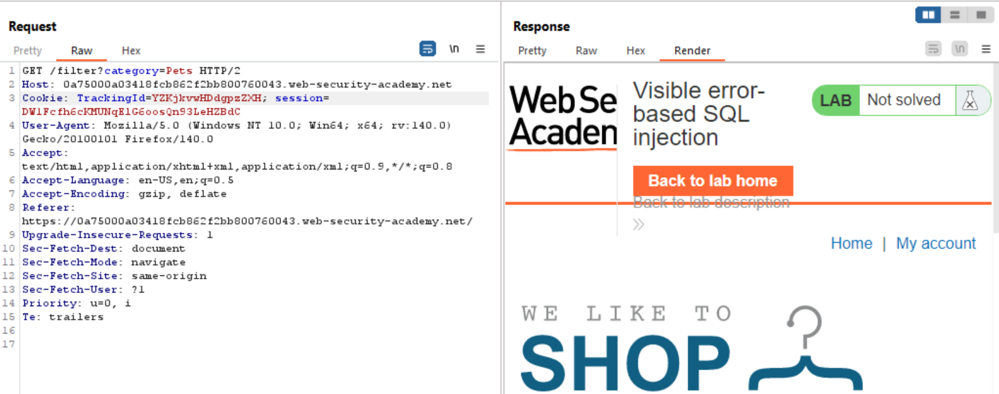

# SQLi Methodology

### **Injecting into String Data:**

1. **Confirm that the application is interacting with the database ->** This can be done with the help of the <mark style="color:yellow;">`%`</mark> character. The <mark style="color:yellow;">`%`</mark> character is a wild-card character in SQL and if inserted into a database query may return a large list of results (based on the overall data present in the database). Anyways, once it's confirmed that the specific parameter in which the <mark style="color:yellow;">`%`</mark> character is injected returns a lot of results, we can start testing the specific parameter for SQL-Injection vulnerabilities.

&#x20;

2. **Prove that the vulnerable query parameter exists** -> This can be tested by a single quote to break out of the SQL query that the application will have constructed to request data from the DB. Observe for any noticeable changes in the application response, whether it being an error that is returned, or if the results differs from the original result. (Look out for 500 ISEs, or any other error that appears to be related to a broken SQL query (not an error like "product not found")). Then, we inject another single quote to complete the query started by the first single quote character we injected, and look to see if we are getting the same results that we would get without injecting the single quote. Then, to validate the SQLi vulnerability, an option is to use concatenation characters in SQL, such as a payload that is " <mark style="color:yellow;">`' || (SELECT '') || '`</mark> " to confirm whether the application attempts to resolve the SQL query injected into the parameter, or is the error being caused by something else. Also try to use the " <mark style="color:yellow;">`' || (SELECT '' FROM dual) || '`</mark> " to check if the DB is Oracle or Postgres

<mark style="color:yellow;">`(SELECT '')`</mark> -> This payload will return a 'NULL' value

<figure><figcaption>
The SELECT '' payload will return NULL
</figcaption></figure>

<mark style="color:yellow;">`' || NULL || '`</mark> -> This means that NULL is being concatenated with rest of the output from the other SQL queries in the context. Anything concatenated with NULL will return the same thing, thus not affecting the output in any fashion, but still telling us that SQL query injected was successfully executed, thereby confirming that SQL queries are being injected for this parameter. &#x20;

### **Injecting into Integer Data:**

**If numerical data is being transmitted to the database by the application, chances are that this numerical value is being transmitted as it is, and is not being transmitted into a string. As a result, it is advised that we perform the above-mentioned attacks to confirm the presence of SQLi but along with that, also perform the following steps:**

1. **Submit a mathematical expression:** If there's a parameter that accepts numerical value <mark style="color:yellow;">`2004`</mark>, try injecting <mark style="color:yellow;">`2006-2`</mark> or <mark style="color:yellow;">`2000+4`</mark>, and check if the response returned by the application is the same that is returned when <mark style="color:yellow;">`2004`</mark> is injected into the parameter. If the response returned is the same, than the parameter may be vulnerable

<figure><figcaption>
The year requested is 2004
</figcaption></figure>

<figure><figcaption>
Th year requested is 2006-2 (which is 2004), and the database does resolve it and returns the result for 2004
</figcaption></figure>

2. **Submit an expression containing SQL methods in it to analyze if the expression is being resolved**: If the above case resolves properly, try injecting a payload that contains a SQL method, and observe if the result is the same. For example, a common SQL method is ASCII(), which can be used to convert the value of the character to it's ASCII value. So, in the below example. we can use the payload 1+ASCII(1) to retrieve the details for the user Clark, since Clark's empId = 50 and ASCII(1)=49.&#x20;

<figure><figcaption>
The original database
</figcaption></figure>

<figure><figcaption>
The empId solves the arithmetic expression involving the SQL ASCII method
</figcaption></figure>
