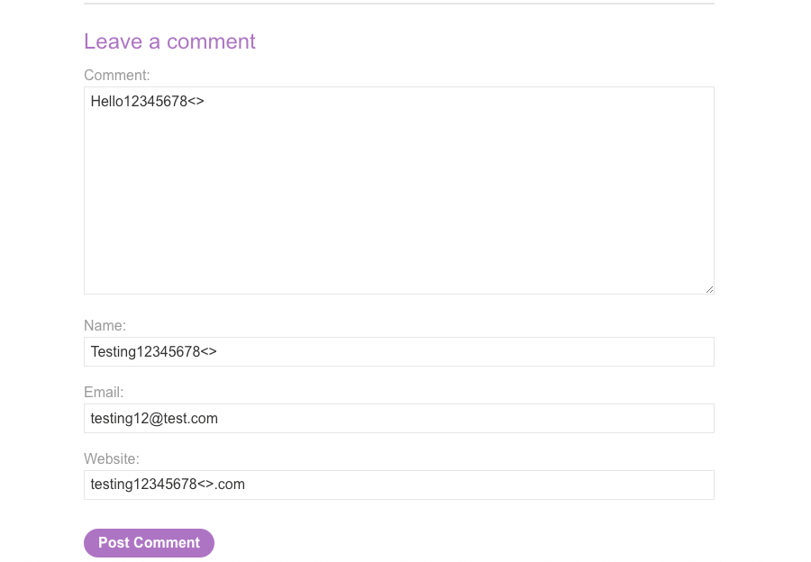

# Burp Lab Solutions

### Lab: Stored XSS into HTML context with nothing encoded

The lab tells us that there's a stored cross-site scripting vulnerability in the comment functionality, and we need to submit a content to make the alert() function pop on the page.

So, if we add this comment to the post (with the website value also containing https://), we see the following response from the server when we reload the post.&#x20;

<figure><figcaption></figcaption></figure>

<figure><figcaption></figcaption></figure>

It's clear that the comment that was posted contains tags that are not being encoded properly. So we can trigger the alert from the comment column.

<figure><figcaption></figcaption></figure>

When we reload the posts, we can see that the we were successfully able to escape the \
 tag, and trigger our XSS payload

<figure><figcaption></figcaption></figure>

<figure><figcaption></figcaption></figure>

### Lab: Stored XSS into anchor `href` attribute with double quotes HTML-encoded

The lab tells us that the injected data can be used to alter the value of the href attribute of an anchor tag. The lab environment is a blog that allows us to leave a comment on the blog, indicating possibility of a stored XSS

<figure><figcaption></figcaption></figure>

<figure><figcaption></figcaption></figure>

It can be seen that the value we entered in the website column is being injected into the href attribute of the anchor tag

<figure><figcaption></figcaption></figure>

<figure><figcaption></figcaption></figure>

In this case, a simple javascript:alert() can do the trick for us! Since it's a hyperlink, we will have to click on it to execute our alert popup.

<figure><figcaption></figcaption></figure>

<figure><figcaption></figcaption></figure>
